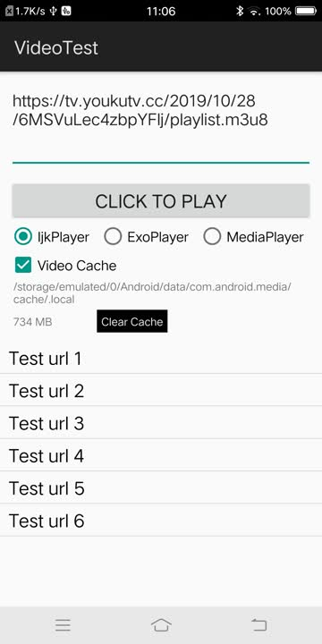
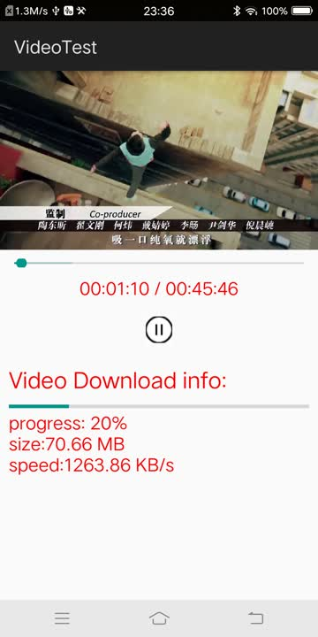

# MediaLocalProxyLib
#### 封装了一个播放器功能库
> * 实现ijkplayer  exoplayer mediaplayer 3种播放器类型；可以任意切换；
> * ijkplayer 是从 k0.8.8分支上拉出来的；
> * exoplayer 是 2.11.1版本
#### 实现视频边下边播的功能
> * 缓存管理
> * 下载管理
> * 本地代理管理模块
> * 回调播放下载实时速度
> * 显示缓存大小




本项目的架构如下：

从上面的架构可以看出来，本项目的重点在本地代理层，这是实现边下边播的核心逻辑；


### 接入库须知
#### 1.在Application->onCreate(...) 中初始化
```
LocalProxyCacheManager.getInstance().initProxyCache(this, 3888);
```

LocalProxyCacheManager.java
```
public void initProxyCache(Context context, int port) {
    File file = LocalProxyUtils.getVideoCacheDir(context);
    if (!file.exists()) {
        file.mkdir();
    }
    mConfig = new LocalProxyCacheManager.Build(context)
            .setCacheRoot(file)
            .setUrlRedirect(true)
            .setIgnoreAllCertErrors(true)
            .setCacheSize(VIDEO_PROXY_CACHE_SIZE)
            .setTimeOut(READ_TIMEOUT, CONN_TIMEOUT, SOCKET_TIMEOUT)
            .setPort(port)
            .buildConfig();
    mProxyServer = new LocalProxyServer(mConfig);
}
```
这儿可以设置一些属性：
1.setCacheRoot     设置缓存的路径；
2.setUrlRedirect   是否需要重定向请求；
3.setCacheSize     设置缓存的大小限制；
4.setTimeOut       设置连接和读超时时间；
5.setPort          设置本地代理的端口；
#### 2.打开本地代理开关
```
    PlayerAttributes attributes = new PlayerAttributes();
    attributes.setUseLocalProxy(mUseLocalProxy);
```
#### 3.设置本地代理模块监听
```
mPlayer.setOnLocalProxyCacheListener(mOnLocalProxyCacheListener);
mPlayer.startLocalProxy(mUrl, null);

private IPlayer.OnLocalProxyCacheListener mOnLocalProxyCacheListener = new IPlayer.OnLocalProxyCacheListener() {
    @Override
    public void onCacheReady(IPlayer mp, String proxyUrl) {
        LogUtils.w("onCacheReady proxyUrl = " + proxyUrl);
        Uri uri = Uri.parse(proxyUrl);
        try {
            mPlayer.setDataSource(PlayerActivity.this, uri);
        } catch (IOException e) {
            e.printStackTrace();
            return;
        }
        mPlayer.setSurface(mSurface);
        mPlayer.setOnPreparedListener(mPreparedListener);
        mPlayer.setOnVideoSizeChangedListener(mVideoSizeChangeListener);
        mPlayer.prepareAsync();
    }

    @Override
    public void onCacheProgressChanged(IPlayer mp, int percent, long cachedSize) {
        LogUtils.w("onCacheProgressChanged percent = " + percent);
        mPercent = percent;
    }
   
    @Override
    public void onCacheSpeedChanged(String url, float cacheSpeed) {
        if (mPlayer != null && mPlayer.get() != null) {
            mPlayer.get().notifyProxyCacheSpeed(cacheSpeed);
        }
    }

    @Override
    public void onCacheFinished(String url) {
        LogUtils.i("onCacheFinished url="+url + ", player="+this);
        mIsCompleteCached = true;
    }
    
    @Override
    public void onCacheForbidden(String url) {
        LogUtils.w("onCacheForbidden url="+url+", player="+this);
        mUseLocalProxy = false;
        if (mPlayer != null && mPlayer.get() != null) {
            mPlayer.get().notifyProxyCacheForbidden(url);
        }
    }
    
    @Override
    public void onCacheFailed(String url, Exception e) {
        LogUtils.w("onCacheFailed , player="+this);
        pauseProxyCacheTask(PROXY_CACHE_EXCEPTION);
    }
};
```
#### 4.本地代理的生命周期跟着播放器的生命周期一起


### 功能概要
#### 1.封装了一个player sdk层
> * 1.1 接入Android 原生的 MediaPlayer 播放器
> * 1.2 接入google的EXO player 播放器
> * 1.3 接入开源的 ijk player 播放器
#### 2.实现整视频的边下边播
> * 2.1 实现整视频的分片下载
> * 2.2 实现整视频的断点下载
#### 3.实现HLS分片视频的边下边播
> * 3.1 实现HLS视频源的解析工作
> * 3.2 实现HLS的边下边播
> * 3.3 实现HLS的断点下载功能
#### 4.线程池控制下载功能
#### 5.提供视频下载的额外功能
> * 5.1 可以提供播放视频或者下载视频的实时网速
> * 5.2 可以提供已缓存视频的大小

如果你觉得这个库有用,请鼓励一下吧;<br>


### 版本LOG
v1.0.0
> * 1.支持MediaPlayer/IjkPlayer/ExoPlayer 三种播放器播放视频；
> * 2.支持M3U8/MP4视频的边下边播功能；
> * 3.本地代理实现边下边播功能；
> * 4.提供当前下载速度和下载进度的回调；

V1.1.0
> * 1.解决https 证书出错的视频url请求，信任证书；
> * 2.解决播放过程中息屏的问题，保持屏幕常亮；
> * 3.增加 isPlaying 接口，表示当前是否正在播放视频；
> * 4.解决Cleartext HTTP traffic to 127.0.0.1 not permitted 问题，Android P版本不允许未加密请求；