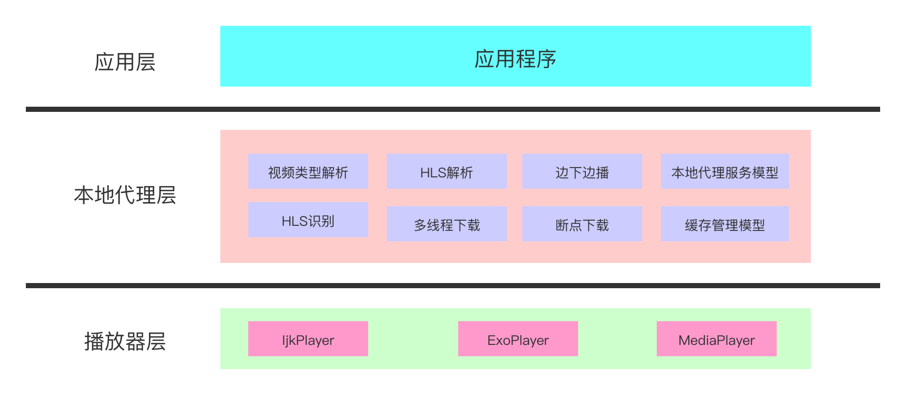
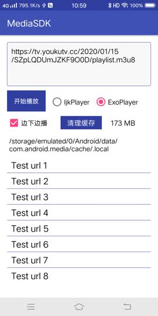

# MediaSDK

The library is working for downloading video while playing the video, the video contains M3U8/MP4 <br>

Developer documentation is here, [Click it](./README_cn.md)<br>

You can refer to the technical documentation：https://www.jianshu.com/p/27085da32a35 <br>

Use the library: <br>
```
allprojects {
  repositories {
    ...
    maven { url 'https://jitpack.io' }
  }
}

dependencies {
        implementation 'com.github.JeffMony:MediaSDK:2.0.0'
}
```

#### The Core functions of the project
> * Cache management, LRU
> * Video downloading management
> * Local proxy management
> * Display downloading speed
> * Display the video cache's size
> * Support the video's downloading while playing the video, M3U8/MP4 video

The project's architecture is as follows：



### Developer documentation
#### 1.Application->onCreate(...)
```
File file = LocalProxyUtils.getVideoCacheDir(this);
if (!file.exists()) {
    file.mkdir();
}
LocalProxyConfig config = new VideoDownloadManager.Build(this)
    .setCacheRoot(file)
    .setUrlRedirect(false)
    .setTimeOut(DownloadConstants.READ_TIMEOUT, DownloadConstants.CONN_TIMEOUT, DownloadConstants.SOCKET_TIMEOUT)
    .setConcurrentCount(DownloadConstants.CONCURRENT_COUNT)
    .setIgnoreAllCertErrors(true)
    .buildConfig();
VideoDownloadManager.getInstance().initConfig(config);
```
1.setCacheRoot            The cache path；
2.setUrlRedirect          Support request's redirect；
3.setCacheSize            Set cache size；
4.setTimeOut              Set request's timeout；
5.setPort                 Set the local proxy server's port；
6.setIgnoreAllCertErrors  Support the certificate；
#### 2.The local proxy server's switch
```
PlayerAttributes attributes = new PlayerAttributes();
attributes.setUseLocalProxy(mUseLocalProxy);
```
#### 3.Set the listener
```
mPlayer.setOnLocalProxyCacheListener(mOnLocalProxyCacheListener);
mPlayer.startLocalProxy(mUrl, null);

private IPlayer.OnLocalProxyCacheListener mOnLocalProxyCacheListener = new IPlayer.OnLocalProxyCacheListener() {
    @Override
    public void onCacheReady(IPlayer mp, String proxyUrl) {
        LogUtils.w("onCacheReady proxyUrl = " + proxyUrl);
        Uri uri = Uri.parse(proxyUrl);
        try {
            mPlayer.setDataSource(PlayerActivity.this, uri);
        } catch (IOException e) {
            e.printStackTrace();
            return;
        }
        mPlayer.setSurface(mSurface);
        mPlayer.setOnPreparedListener(mPreparedListener);
        mPlayer.setOnVideoSizeChangedListener(mVideoSizeChangeListener);
        mPlayer.prepareAsync();
    }

    @Override
    public void onCacheProgressChanged(IPlayer mp, int percent, long cachedSize) {
        LogUtils.w("onCacheProgressChanged percent = " + percent);
        mPercent = percent;
    }

    @Override
    public void onCacheSpeedChanged(String url, float cacheSpeed) {
        if (mPlayer != null && mPlayer.get() != null) {
            mPlayer.get().notifyProxyCacheSpeed(cacheSpeed);
        }
    }

    @Override
    public void onCacheFinished(String url) {
        LogUtils.i("onCacheFinished url="+url + ", player="+this);
        mIsCompleteCached = true;
    }

    @Override
    public void onCacheForbidden(String url) {
        LogUtils.w("onCacheForbidden url="+url+", player="+this);
        mUseLocalProxy = false;
        if (mPlayer != null && mPlayer.get() != null) {
            mPlayer.get().notifyProxyCacheForbidden(url);
        }
    }

    @Override
    public void onCacheFailed(String url, Exception e) {
        LogUtils.w("onCacheFailed , player="+this);
        pauseProxyCacheTask(PROXY_CACHE_EXCEPTION);
    }
};
```

demo：<br>



